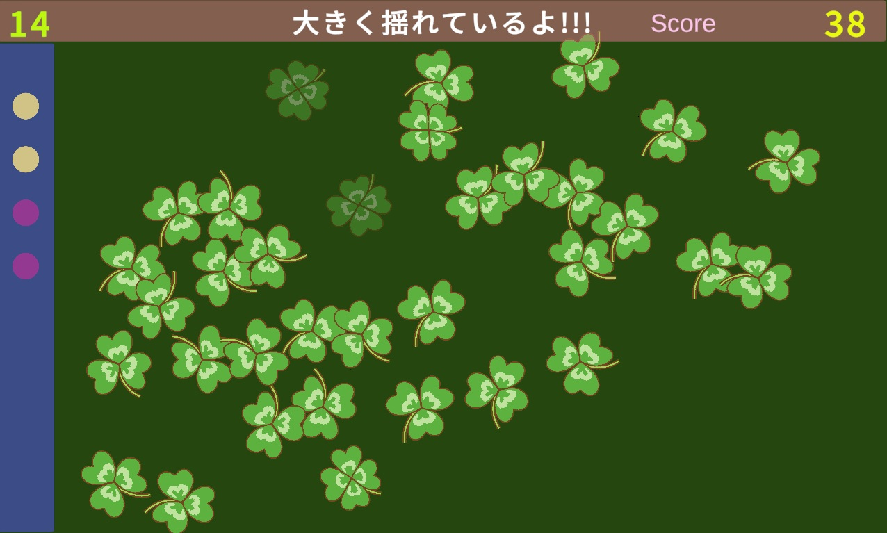

# Find Lucky Flowers
## FindLuckyFlowersについて
他とはちょっと違う動きをするラッキーフラワーを見つけるゲーム。
お花畑に風を送り、揺れる花の中から幸運のLucky Flower をみつけましょう。
  
Lucky Flowerは他とはちょっと違う動きをしているよ。その違いを見つけてあげてね。
そうすればあなたもLucky Flowerをゲットすることができるよ!!

## ゲームプレイ方法
[ゲームのサンプルプレイ(工事中)](https://hoshino-moz.github.io/BattleCart_Web/)



  
### 操作方法
* お花畑が出てきたら、画面をなぞって風を送ってね。マウスでは、左ボタンを押しながらなぞってあげて。
* 揺れるお花の中から Lucky Flower を見つけたらクリックしてね。
* Lucky Flower の数は左のインジケーターを見てね。

### ゲームルール
* 風を送らないでいると3秒後に自動的に風が吹くよ。
* 左上に残りの秒数があるから注意してね。
* 早く見つけるほど得点が高いよ。またステージレベルによって得点が違うよ。
* 何回か繰り返すと、動きが見えてくるよ。コツは全体を見ることだね。
  　
## 使用技術
* ゲームエンジン：Unity6
* 使用言語：C#
* 使用ツール：VisualStudio、

## 開発の工夫
* 開発期間：30時間
* 担当範囲：企画～アセットの導入、プログラミング、デバッグ仕上げ
* こだわった点：
お花の動きの自然さや、 Lucky Flower の特徴の出し方
動き始めに風を送る演出。ユーザーが見やすい揺れ方の作り方など、ただ揺れるだけでなく、ここにもプレイヤーの意図が入れられるところ。
* 技術的な調整：
自然な動きをさせるうえで、強制的な動きのコントロールと、RigidBodyの物理演算結果のブレンドを調整した。

### スクリプトの詳細
* Flower.cs  
動きの心臓部、振幅、減衰、周期、縦横合成、方向などを制御している。
```C#
   //実際の動き
   void MoveFlower()
{
    timer = timer + Time.deltaTime;

    moveX = ampX * Mathf.Exp(-dampX * timer) * Mathf.Sin(freqX * timer * Mathf.PI);
    moveY = ampY * Mathf.Exp(-dampY * timer) * Mathf.Cos(freqY * timer * Mathf.PI);
    //Velocity 代入
    rbody.linearVelocity = new Vector2((moveX * diffX) + (moveY * -diffY), (moveX * diffY) + (moveY * diffX));
}
```
diffX diffY は風の向き。風の発生元と、花の位置から算出しています。
```C#
//InputCircleとぶつかったらお花の動き発動
private void OnTriggerEnter2D(Collider2D collision)
{
    if (colliOnce) return;
    //ぶつかった相手がInputCircleだったら
    if (collision.gameObject.CompareTag("InputCircle"))
    {
        isMove = true;
        colliOnce = true;

        //花とInputCircleとの差を取得し、方向を決める　風の方向に揺れる
        Vector3 v = (transform.position - collision.gameObject.transform.position).normalized;
        diffX = v.x;
        diffY = v.y;
    }
}
```

* GameController.cs  
風を送る演出、画面をなぞるとそこから裏で Circle Collider を発生させている
```C#
void WindBlowing()
{
    inputTime = inputTime + Time.deltaTime;
    if (Input.GetMouseButton(0))
    {
        // マウスのスクリーン座標を取得
        Vector3 mousePosition = Input.mousePosition;
        // スクリーン座標をワールド座標に変換
        Vector3 worldPosition = Camera.main.ScreenToWorldPoint(mousePosition);
        // z座標が0になるように調整（2D向け）
        worldPosition.z = 0f;

        // 指定した場所にプレハブを生成
        Instantiate(InputCircle, worldPosition, Quaternion.identity);

        isBlow = true;
    }
```
* InputCircle.cs  
発生させた風はこちらのスクリプトで影響力を波紋のように広げている
```C#
 void Update()
 {
     timer = timer + Time.deltaTime;

     if (timer < 5.0f)
     {
         transform.localScale = new Vector3(timer * windSpeed, timer * windSpeed, 1);
     }
 }
```

## 今後の展望  
* ステージ数を増やして、いろいろな動き、難易度を作りこんでいきたい。
* 動きの種類、難易度などを一覧で見ることができて、
プレイヤーがトレーニングコースの作成、選択までできるようにしたい。
* スコアによる、自分自身の成長が可視化できるようにしたい。
* さらにライバルとの比較もできるようになれば、、GameCenter などのクラウド技術を勉強する。
  